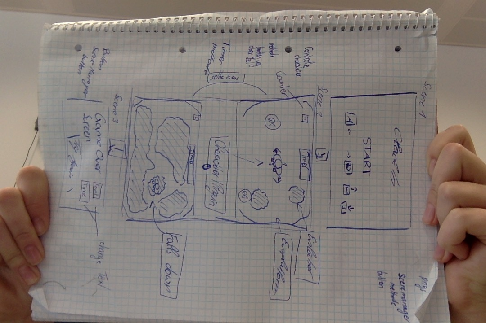
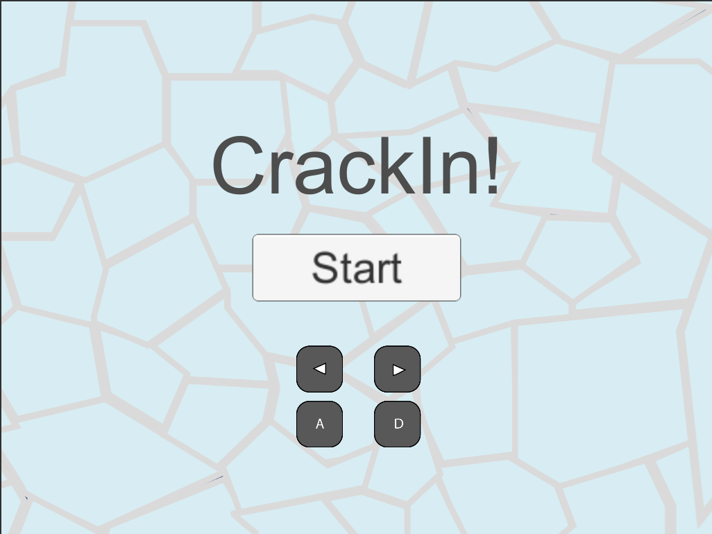
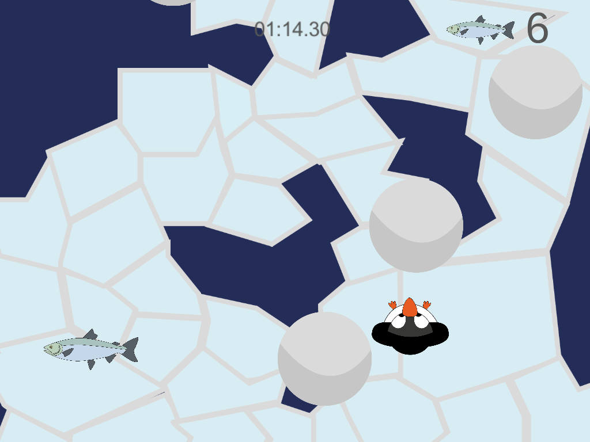
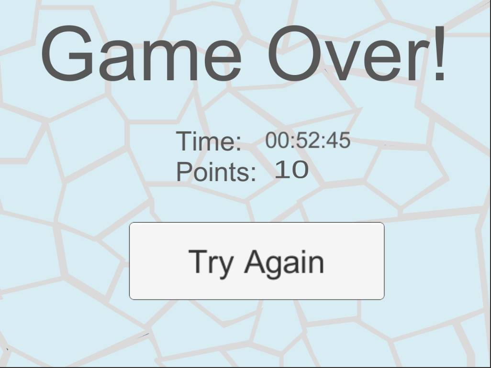

# CrackIn
*What's it about?

"CrackIn" is a 2D single player game which is shown from the top view. You are a penguin and you have to move on an ice platform. Pieces of the ice surface can break in at any time and form water leaks. You can move left and right. You automatically move up and the moving snowballs push the penguin down. Your task is in, to stay on the surface as long as possible and avoid the holes. You can collect delicious fish to get more points. Also there is a stop watch wich captures the time you survived on the sheet.

*Screenshots

-Concept

-Start

-GamePlay

-GameOver

*Runtime Version: .NET 3.5 Equivalent
*API Level_  .NET 2.0 Subset

*Development Plattform

macOS Mojave version 10.14 
Unity 2018.2.14f1 
VS 7.7.0.1868

*Target platform

Pc Standalone (1024x768)

*Scripts

-StopWatch by Valerian Tschopp
-ItemsSpawner & Random Snowball by Clea Eliasch
-Fish & GameLogic by Sarah Glavan

*Progress 95% done

-User Interface
-Add Stopwatch
-Add Counter
-Player interaction with world
-Ranom functions 

*Lessons Learned

program icon Counters, Spawn random objects, Stopwatch,
random hidden Layers and activate Colliders,

Copyright Carolin Hollweger 

 

